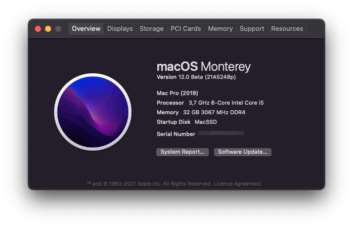

# Opencore(0.7.0) Configuration for ASUS-Z370A (MacOS 12.0 Monterey Beta 1)

## Tested with following specs:

- ASUS PRIME Z370-A
- Intel i5-9600KF
- Sapphire NITRO+ RX 580 4G

## What's working
- Booting
- Sound
- Ethernet
- Dual Monitors
- Sleep (but not deep) & Wake
- USB (make sure that keyboard and mouse are plugged into USB 2.0)

## Issues
- Deep sleep
- Bluetooth dongle not working
